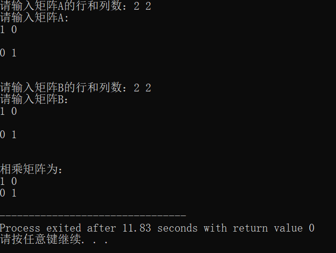
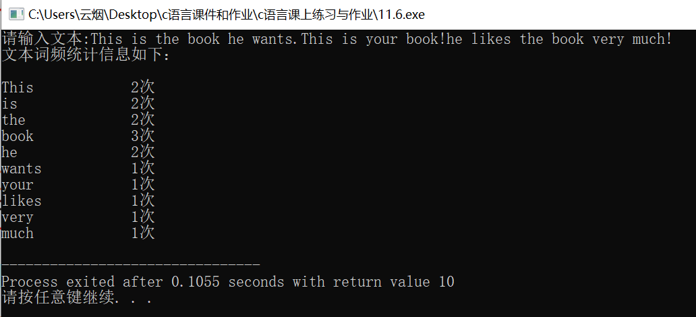

# 大一上c语言期末考试
## 第一题
### ※源码
```c
#include<stdio.h>
#include<string.h>
#include<stdlib.h>
#define size 100
void multiply(int (*p)[size],int (*q)[size],int r1,int c1,int r2,int c2)
{
	int i,j,len,k;
	int multiply[size][size];
	int sum[size]={0};

		for(i=0;i<r1;i++)
		{
			for(j=0;j<c2;j++)
			{
				for(k=0;k<c2;k++)
				{
					multiply[i][j]+=(*(*(p+i)+k))*(*(*(q+k)+j));
				
				}
			}
		} 
		printf("\n");
		printf("相乘矩阵为：\n");
		for(i=0;i<r1;i++)
		{
			for(j=0;j<c2;j++)
			{
				printf("%d ",multiply[i][j]);
			}
			printf("\n");
		}
		

}

int main()
{
	int r1,c1,r2,c2;
	int i,j;
	int (*matrixA)[size];
	int (*matrixB)[size];
	matrixA=(int(*)[size])malloc(sizeof(int[size])*5);
	matrixB=(int(*)[size])malloc(sizeof(int[size])*5);
	printf("请输入矩阵A的行和列数：");
	scanf("%d%d",&r1,&c1);
	getchar();
	printf("请输入矩阵A:\n");
	for(i=0;i<r1;i++)
	{
		for(j=0;j<c1;j++)
		{
			scanf("%d",&(*(matrixA+i))[j]);
		}
		printf("\n");
	}
	printf("\n");
	printf("请输入矩阵B的行和列数：");
	scanf("%d%d",&r2,&c2);
	getchar();
	printf("请输入矩阵B：\n");
	for(i=0;i<r2;i++)
	{
		for(j=0;j<c2;j++)
		{
			scanf("%d",&(*(matrixB+i))[j]);
		}
		printf("\n");
	}
	if(c1!=r2)
	printf("两矩阵无法进行相乘");
	else
	multiply(matrixA,matrixB,r1,c1,r2,c2);

	free(matrixA);
	free(matrixB);
	return 0;
	
}

```
### ※运行结果截图


## 第二题
### ※源码
```c
#include<stdio.h>
#include<string.h>
#include<stdlib.h>
typedef struct WordCounter 
{    
	char *word;//可以用来存储单词    
	int word_count; 
} WordCounter;
//这个结构体可以用来存储单词以及出现次数，之后打印也用结构体 

int main()
{
	WordCounter word[50];
	int num=50,size=50,i,j;
	printf("请输入文本:This is the book he wants.This is your book!he likes the book very much!\n");
	char text[]="This is the book he wants.This is your book!he likes the book very much!";
	char word_separators[] = {' ',',',':','?','!','.'}; 
	word[0].word=strtok(text,word_separators);
	word[0].word_count=1;
	char *temp=NULL;
	int word_num=1,flag;
	printf("文本词频统计信息如下：\n");
	while(1)
	{
		flag=0;
		temp=strtok(NULL,word_separators);//temp每一次切的没有错 
		if(temp==0)
		break;
		for(i=0;i<word_num;i++)
		{
			if(strcmp(temp,word[i].word)==0)
			{
				word[i].word_count++;
				flag=1;
				break;
			}
		}
		if(flag==0)
		{
			word[word_num].word=temp;
			word[word_num].word_count=1;
			word_num++;
		}
		
	}
	printf("\n");
	for(i=0;i<word_num;i++)
	{
		printf("%s\t\t%d次\n",word[i].word,word[i].word_count);
	}
	
}
```
### ※运行结果截图

### ※存在问题
- 未完成1：多⾏⽂本⽤char** text来进⾏存储，使⽤动态分配内存为其开辟内存空间，避免内存空间的浪费。
  
  考虑解决方式：
  ```c
  char **text=NULL;
	text=(char **)malloc(size*sizeof(char *));
	printf("请输入文本信息：");
	for(i=0;i<num;i++)
	{
		*(text+i)=(char *)malloc(10000*sizeof(char));
		scanf("%[^\n]",*(text+i));
	}
	printf("打印出文本信息：");
	for(i=0;i<num;i++)
	{
		printf("%s",*(*(text)));
	}
	```
- 未完成2：划分子函数并且指针为其形参之一
- 未完成3：没有输出热门词频，考虑使用找次数最大和找次数第二大的程序方式来实现

## 第三题
### ※源码
```c
#include<stdio.h>
#include<string.h>
#include<stdlib.h>
#include<time.h> 


typedef struct luckymoney 
{    
	char *name;//参与游戏的人    
	float money; //参与游戏人的余额 
}luckymoney;


typedef struct pocket
{
	char *name;//发红包的人姓名 
	float sum;//红包总金额【元 
	int pocket_num;//红包数量 
	char *wish;//红包祝福【用于区别不同红包 
}pocket;

void lucky(pocket *pocket,luckymoney *luck,int index_1,int index_2)//这个函数用来写每一包红包的金额 
{
	int money_fen;//将总金额转换成以分为单位
	int luckmon;//代表抢到的钱【分】 
	money_fen=(int)(pocket[index_2].sum*100);
	if(pocket[index_2].pocket_num>1)
	{
		luckmon=rand()%(money_fen)+1;
		pocket[index_2].sum-=(float)luckmon/100;
		printf("%s抢到了%.2f元\n",luck[index_1].name,(float)luckmon/100);
		luck[index_1].money+=(float)luckmon/100;
		pocket[index_2].pocket_num--;
	}
	else if(pocket[index_2].pocket_num==1)
	{
		printf("%s抢到了%.2f元\n",luck[index_1].name,pocket[index_2].sum);
		luck[index_1].money+=pocket[index_2].sum;
		pocket[index_2].pocket_num--;
	}
	else if(pocket[index_2].pocket_num==0)
	{
		printf("手慢了，红包已被抢光\n");
	}
	
}


int main()
{
	srand(time(NULL));
	int num,i,j;
	float pocket_money; //抢红包者抢到的红包金额 
	char *graber=(char*)malloc(sizeof(char)*10);//抢红包的人名字 
	char *pocket_wish=(char*)malloc(sizeof(char)*100);//抢红包的人选择的红包祝福 
	printf("请输入群成员个数：");
	scanf("%d",&num);
	getchar();
	luckymoney luck[num];
	printf("请输入群成员名单：");
	char *namelist=(char*)malloc(sizeof(char)*100);
	//要为结构体指针变量动态分配内存空间，不然name没有初始化内存空间，无法存储！
	gets(namelist);//将名字名单存进去
	char cut[]={','};
	for(i=0;i<num;i++)
	{
		luck[i].name=(char*)malloc(sizeof(char)*10);
	}
	luck[0].name=strtok(namelist,cut);
	luck[0].money=100;
	for(i=1;i<num;i++)
	{
		luck[i].money=100;//设立每人初试余额为100元 
		luck[i].name=strtok(NULL,cut);
	}//建立了每一个人的红包账户，奈斯【结构体里包括了：姓名，金钱】
	
	char w='y';
	char grab='y';
	pocket pocket[100];
	for(i=0;i<100;i++)
	{
		pocket[i].name=(char*)malloc(sizeof(char)*10);
		pocket[i].wish=(char*)malloc(sizeof(char)*100);
	}//要为结构体指针变量动态分配内存空间，不然name没有初始化内存空间，无法存储！ 
	
	int bag_num=0;//发红包的包数 
	printf("\n");
	for(i=0;i>=0;i++)
	{
		printf("发红包者：");
		gets(pocket[i].name);
		printf("红包金额：");
		scanf("%f",&pocket[i].sum);
		for(j=0;j<num;j++)
		{
			if(strcmp(pocket[i].name,luck[j].name)==0)
			{
				luck[j].money-=pocket[i].sum;
				//printf("余额%.2f\n",luck[j].money);
			}
			
		}//发红包者的余额要减去发红包金额 
		getchar();
		printf("红包数量：");
		scanf("%d",&pocket[i].pocket_num);
		getchar();
		printf("红包祝福：");
		gets(pocket[i].wish);
		printf("是否继续发红包？"); 
		scanf("%c",&w);
		getchar();
		printf("\n");
		if(w=='n')
		{
			break;
		}
		else
		bag_num++; 
	}
	printf("\n");

	int index_1,index_2;
	while(grab=='y')
	{
		printf("抢红包者：");
		gets(graber);
		for(i=0;i<num;i++)
		{
			if(strcmp(graber,luck[i].name)==0)
			index_1=i;
		}
		printf("抢红包：");
		gets(pocket_wish);
		for(i=0;i<2;i++)
		{
			if(strcmp(pocket_wish,pocket[i].wish)==0)
			index_2=i;
		}
		lucky(pocket,luck,index_1,index_2);
		printf("是否继续抢红包？");
		scanf("%c",&grab);
		getchar();
		printf("\n");
	}
	printf("\n");
	//查询余额
	char check='y';
	char *check_name=(char*)malloc(sizeof(char)*10);
	while(check=='y')
	{
		printf("请输入你想要查询的人名：");
		gets(check_name);
		for(i=0;i<num;i++)
		{
			if(strcmp(check_name,luck[i].name)==0)
			{
				printf("%s的余额为%.2f元\n",luck[i].name,luck[i].money);
			}
		}
		printf("是否要继续查询？");
		scanf("%c",&check);
		getchar();
	}


}


